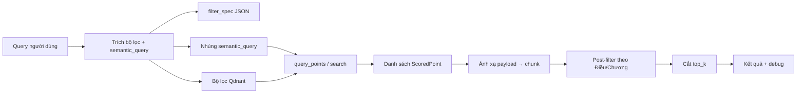

# Truy vấn tài liệu pháp luật từ câu hỏi (query): tài liệu kỹ thuật

Tài liệu mô tả **luồng xử lý từ chuỗi người dùng nhập (`query`) đến danh sách đoạn văn bản (`chunks`) được trả về**, theo triển khai trong `src/long_parser/retrieval/legal_retrieve.py` và dữ liệu nền tạo bởi `src/long_parser/embedding/embed_qdrant_chunks.py` (CLI: `scripts/legal_retrieve.py`, `scripts/embed_qdrant_chunks.py`).

---

## 1. Bối cảnh hệ thống

- **Cơ sở vector**: Qdrant (HTTP, mặc định `http://localhost:6333`).
- **Collection**: mặc định `legal_chunks`, vector tên `dense`, khoảng cách cosine (tạo collection khi embed lần đầu).
- **Mô hình nhúng (embedding)**: mặc định `bkai-foundation-models/vietnamese-bi-encoder` — **phải trùng** giữa lúc **ghi index** (`scripts/embed_qdrant_chunks.py`) và lúc **truy vấn** (`scripts/legal_retrieve.py`); nếu khác model, điểm tương đồng không còn ý nghĩa.
- **Nội dung được mã hóa lên vector** (khi embed): trường `search_text` của từng chunk trong file retrieval JSON. Khi truy vấn, hệ thống mã hóa **`semantic_query`** (phần còn lại sau khi tách metadata khỏi câu hỏi) — hai chuỗi này cùng không gian ngữ nghĩa nên vector search hoạt động hợp lý.

---

## 2. Tổng quan các bước (pipeline)



Thứ tự logic trong code:

1. **Chuẩn bị `semantic_query` và `filters`** — từ query thuần hoặc từ file JSON ghi đè (`--filter-json`).
2. **Gói đặc tả** (`filter_spec`) — JSON chuẩn `version`, `semantic_query`, `filters`.
3. **Dựng `Filter` cho Qdrant** — chỉ các điều kiện dùng `MatchValue` / `MatchAny` (tương thích client).
4. **Tính vector** — `SentenceTransformer.encode(semantic_query)` (hoặc query gốc nếu `semantic_query` rỗng).
5. **Điều chỉnh `limit` truy vấn** — nếu cần post-filter (Điều / tiêu đề chương), lấy nhiều ứng viên hơn trước khi lọc.
6. **Gọi Qdrant** — `query_points(..., query=vec, using=vector_name, query_filter=...)` (hoặc `search` trên client cũ).
7. **Chuyển hits → cấu trúc chunk** — `score`, `id`, các trường payload (`chunk_id`, `return_text`, …).
8. **Post-filter** — `article_number`, `chapter_title_contains` (không đưa vào filter Qdrant theo thiết kế hiện tại).
9. **Trả `top_k`** chunk và khối **debug** (`filter_spec`, `qdrant_filter`, `search_limit`, `post_filter_applied`).

---

## 3. Bước 1 — Trích xuất từ query (`extract_filters_from_query`)

Hành vi: **quy tắc regex / từ khóa**, không gọi mô hình ML bên ngoài.

### 3.1. Các trường trong `filters`

| Trường | Nguồn gợi ý từ query | Ghi chú |
|--------|----------------------|---------|
| `document_id` | Mã dạng `01.2025.tt-btc_20250115052759`, URL-encoding có được chuẩn hóa (`%C4%91` → `đ`) | Trùng payload khi embed |
| `issue_date` | `dd/mm/yyyy`, `dd-mm-yyyy`, hoặc “ngày … tháng … năm …” | Chuẩn hóa lưu `dd/mm/yyyy` |
| `chapter_number` | “Chương …” + số La Mã hoặc Ả Rập | Số Ả Rập đổi sang La Mã (1→I, 2→II, …) để khớp `metadata.hierarchy.chapter_number` |
| `article_number` | “Điều 3”, “điều 12a” | Lưu dạng chữ thường (ví dụ `3`, `12a`) — **chỉ dùng post-filter** |
| `issuing_agency` | BTC, Bộ Tài chính, BHXH, … (danh sách alias trong code) | Giá trị **chuẩn hóa** (ví dụ “Bộ Tài chính”) — so khớp **trong filter Qdrant** (MatchValue) |
| `domains` | “pháp luật”, “vbqppl”, … | Gán `["law"]` — filter Qdrant `MatchAny` |
| `chunk_type` | Có mẫu “điều” + số | Gán `"article"` — filter Qdrant |
| `signer` | *(template có trường; regex query không tự điền trong đoạn trích hiện tại)* | Có thể đặt qua `--filter-json` |
| `chapter_title_contains` | *(regex query không tự điền)* | **Post-filter** trên `metadata.hierarchy.chapter_title` |

Các đoạn văn bản nhận diện được **được loại khỏi** chuỗi dùng cho embedding (theo span), để **`semantic_query`** chỉ còn phần “ý nghĩa tự do” (ví dụ sau khi bỏ “Điều 3”, “Thông tư …” còn lại là phần mô tả chủ đề).

Sau khi nối phần còn lại, code còn **xóa nhẹ** các từ nối thừa (`ban hành`, `theo`) để giảm nhiễu.

### 3.2. Ghi đè bằng file JSON

Nếu gọi với `--filter-json path.json`, **không** chạy trích regex trên query cho phần filter; file phải có dạng:

- `semantic_query`: chuỗi dùng để embed.
- `filters`: object cùng các key như bảng trên.

Mẫu cấu trúc: `config/schemas/query_filter_template.json`.

---

## 4. Bước 2 — `filter_spec` (JSON chuẩn)

```json
{
  "version": 1,
  "semantic_query": "...",
  "filters": { ... }
}
```

Đây là **hợp đồng dữ liệu** giữa bước trích xuất, lưu file (`--dump-filter`), và debug output.

---

## 5. Bước 3 — Bộ lọc Qdrant (`filters_to_qdrant`)

Chỉ các field sau **được dựng thành `Filter.must`** (điều kiện AND):

- `document_id` — `MatchValue`
- `chunk_type` — `MatchValue`
- `issue_date` — `MatchValue`
- `domains` — `MatchAny`
- `issuing_agency` — `MatchValue` (chuẩn hóa strip)
- `signer` — `MatchValue`
- `chapter_number` — `MatchValue` trên key payload `metadata.hierarchy.chapter_number`

**Không** đưa vào Qdrant filter (lý do kỹ thuật / thiết kế):

- `article_number` — cần khớp mẫu trong `chunk_id` (`__dieu_{n}__`); client dùng bộ Match hạn chế nên **lọc sau**.
- `chapter_title_contains` — so khớp chuỗi con tiêu đề chương — **lọc sau**.

Nếu không có điều kiện `must` nào, `query_filter` = `None` (tìm trên toàn bộ điểm trong collection).

---

## 6. Bước 4 — Embedding

- Input: `semantic_query` (nếu rỗng thì dùng nguyên `query`).
- Output: vector dense cùng chiều với lúc tạo collection.
- Cùng model + cùng kiểu chuẩn hóa (SentenceTransformers) với `scripts/embed_qdrant_chunks.py`.

---

## 7. Bước 5 — `search_limit` trước post-filter

- Mặc định: `search_limit = top_k`.
- Nếu có `article_number` hoặc `chapter_title_contains`:  
  `search_limit = max(top_k * 10, 50)`  
  để sau khi lọc theo Điều/tiêu đề chương vẫn đủ `top_k` kết quả.

---

## 8. Bước 6 — Gọi Qdrant

- **Client mới** (ví dụ `qdrant-client` ≥ 1.17): `query_points(collection_name, query=vec, using="dense", query_filter=..., limit=..., with_payload=True)`, lấy `resp.points`.
- **Client cũ**: `search(collection_name, query_vector=(vector_name, vec), ...)`.

Điểm trả về: `id`, `score`, `payload` (theo schema lúc upsert).

---

## 9. Bước 7 — Ánh xạ payload → chunk ứng dụng

Mỗi hit được chuyển thành object gồm các trường tiêu biểu:

- `score`, `id`, `chunk_id`, `document_id`, `title`, `chunk_type`, `issue_date`, `issuing_agency`
- `return_text`, `search_text`, `metadata`, `source_file`

---

## 10. Bước 8 — Post-filter (`_post_filter_chunks`)

- **`article_number`**: `chunk_id` phải chứa (không phân biệt hoa thường) chuỗi con `__dieu_{article_number}__`.
- **`chapter_title_contains`**: `metadata.hierarchy.chapter_title` phải chứa chuỗi con (không phân biệt hoa thường).

Thứ tự: lọc theo Điều, rồi theo tiêu đề chương (nếu có).

---

## 11. Bước 9 — Kết quả cuối

- Giữ tối đa **`top_k`** chunk sau post-filter.
- **`debug`** gồm:
  - `filter_spec`
  - `qdrant_filter` (serialized)
  - `search_limit`
  - `post_filter_applied` (boolean)

---

## 12. Chạy từ dòng lệnh (tham khảo)

```bash
python3 scripts/legal_retrieve.py "Điều 3 Thông tư" --top-k 8 --print-spec --dump-filter /tmp/filter.json
```

Biến môi trường / tham số hữu ích:

- `QDRANT_URL` hoặc `--qdrant-url`
- `--collection`, `--vector-name`, `--model`
- `--filter-json` để bỏ qua trích regex và dùng spec tay

---

## 13. Rủi ro và hạn chế cần biết

- **Độ chính xác trích query** phụ thuộc regex: truy vấn mơ hồ có thể không điền filter hoặc điền sai.
- **Post-filter Điều** phụ thuộc quy ước đặt `chunk_id` khi sinh retrieval JSON (`__dieu_…__`).
- **`issuing_agency` trong Qdrant là MatchValue**: nếu payload lưu khác một ký tự so với giá trị chuẩn hóa từ alias, điểm có thể bị loại hết.
- **Không có tìm sparse/BM25** trong module truy vấn; chỉ dense vector + filter + post-filter.

---

## 14. Liên kết file trong repo

| File / thư mục | Vai trò |
|----------------|---------|
| `src/long_parser/retrieval/legal_retrieve.py` | Toàn bộ pipeline truy vấn |
| `scripts/legal_retrieve.py` | Entry CLI (thêm `src/` vào `PYTHONPATH`) |
| `src/long_parser/embedding/embed_qdrant_chunks.py` | Tạo/nạp vector và payload vào Qdrant |
| `scripts/embed_qdrant_chunks.py` | Entry CLI embed |
| `config/schemas/query_filter_template.json` | Mẫu JSON filter / ghi chú ý nghĩa trường |
| `src/long_parser/retrieval/type1_to_retrieval.py` | (Luồng upstream) Chuẩn hóa JSON phục vụ embed |
| `scripts/type1_to_retrieval_json.py` | Entry CLI chuyển type1 → retrieval |

---

*Tài liệu phản ánh hành vi code tại thời điểm tạo; khi sửa module truy vấn, nên cập nhật lại các mục tương ứng.*
